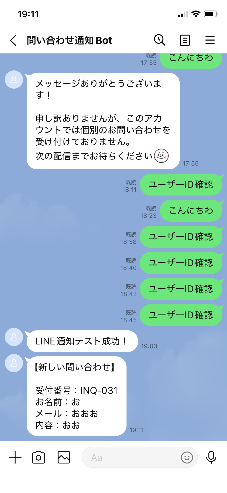

# 問い合わせ管理システム

Google Forms・Google Sheets・Google Apps Script（GAS）を使用して作成した問い合わせ管理システムです。

## 概要

フォームから送信された問い合わせを自動で管理し、受付番号の発行・対応状況管理・自動返信メール・Slack通知・LINE通知を行えるシステムです。

## 使用技術

* Google Forms
* Google Sheets
* Google Apps Script（GAS）
* Gmail
* Slack Webhook
* LINE Messaging API
* GitHub

## 主な機能

* 問い合わせ番号の自動採番
* 問い合わせ内容の自動保存
* 対応状況管理（未対応・対応中・完了）
* 完了日の記録
* 自動返信メール送信
* Slack通知
* LINE通知
* スマホへのPush通知

## システム構成

```text
Google Forms
↓
Google Sheets
↓
Google Apps Script
↓
受付番号自動採番
↓
自動返信メール
↓
Slack通知
↓
LINE通知
↓
スマホで確認
```
## スクリーンショット

### 問い合わせフォーム


### 管理画面


### 自動返信メール


### Slack通知


### LINE通知



## 工夫した点

* 受付番号を自動発行し、問い合わせ管理をしやすくした
* ステータス管理により対応状況を可視化した
* 自動返信メールで受付完了を自動通知できるようにした
* Slack通知とLINE通知を実装し、問い合わせの見落としを防げるようにした
* LINE Messaging APIを利用し、スマホへ直接通知を送信できるようにした
* 通知文を見やすく整え、問い合わせ内容をすぐ確認できるようにした

## 学習したこと

* Googleフォームとスプレッドシートの連携
* GASによる自動処理
* フォーム送信トリガー
* 自動メール送信
* Slack通知自動化
* LINE Messaging APIの利用方法
* Webhook連携
* 業務フローの自動化

## 今後の改善案

* ダッシュボード強化
* 月別集計機能追加
* 検索機能追加
* AIによる問い合わせ分類機能

## 注意事項

このリポジトリには以下の機密情報は含まれていません。

* Gmailアドレス
* Slack Webhook URL
* LINEチャネルアクセストークン
* LINEユーザーID
* APIキー

実際に利用する場合は各自の環境に合わせて設定してください。

