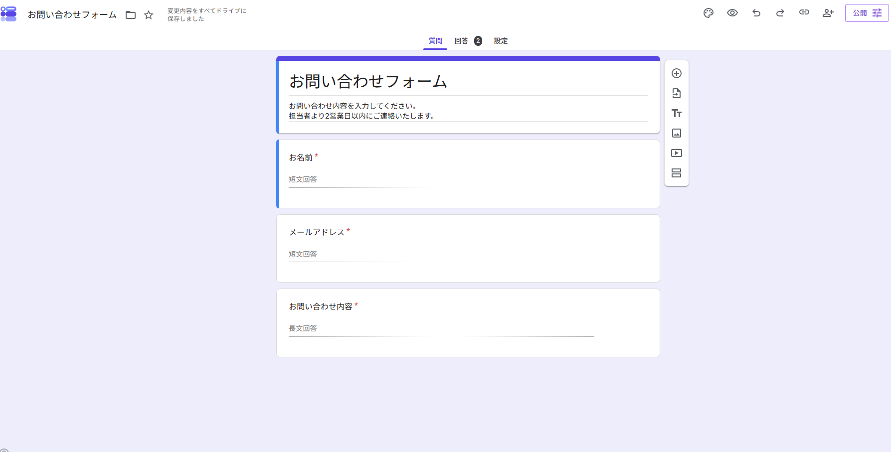
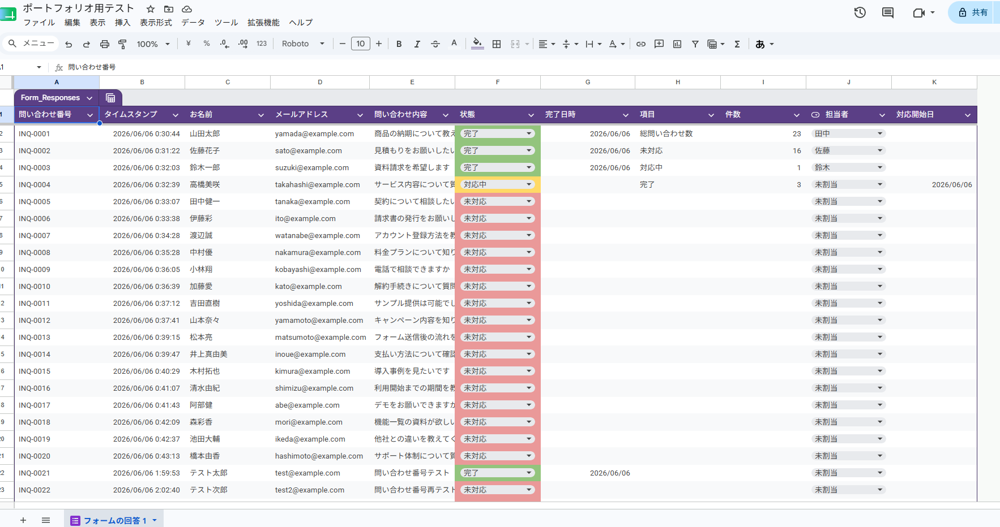
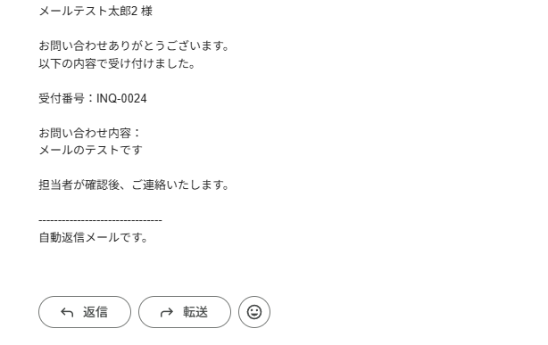
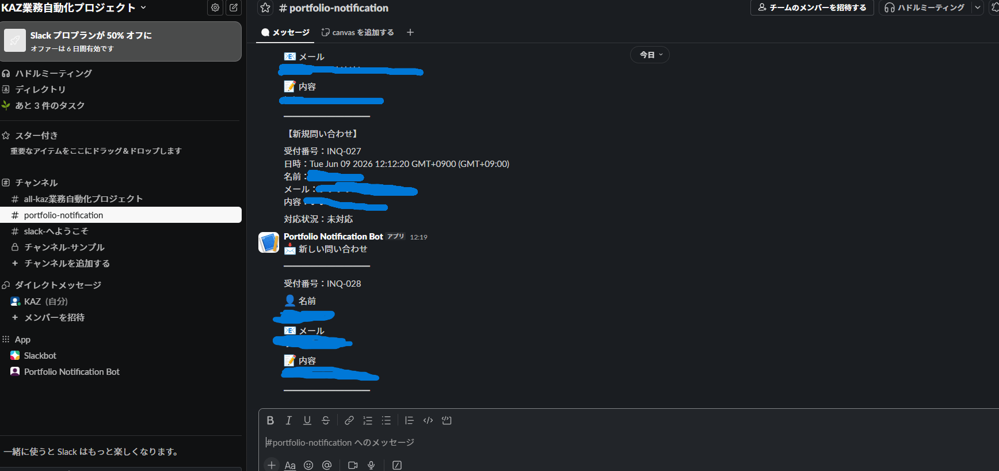

# 問い合わせ管理システム

Googleフォーム・Googleスプレッドシート・Google Apps Script（GAS）を使用して作成した問い合わせ管理システムです。

## 概要

フォームから送信された問い合わせを自動で管理し、対応状況や担当者の管理を行えるシステムです。

## 使用技術

* Google Forms
* Google Sheets
* Google Apps Script（GAS）
* Slack Webhook

## 主な機能

* 問い合わせ番号の自動採番
* 問い合わせ内容の自動保存
* 対応状況管理（未対応・対応中・完了）
* 担当者管理
* 対応開始日の記録
* 完了日の記録
* 問い合わせ件数集計
* 自動返信メール送信
* Slack通知

## システム構成

Googleフォーム
↓
スプレッドシートへ自動保存
↓
GASで問い合わせ番号を自動採番
↓
自動返信メール送信
↓
対応状況を管理

## スクリーンショット

### 問い合わせフォーム

### 管理画面

### 自動返信メール

### Slack通知

## 学習したこと

* Googleフォームとスプレッドシートの連携
* GASによる自動処理
* 業務フローの自動化
* ステータス管理の仕組み
* 自動メール送信
* Slack通知自動化
* Webhook連携
* フォーム送信トリガー

## 今後の改善案

* LINE通知機能
* ダッシュボード強化
* 検索機能追加
* 月別集計機能追加
